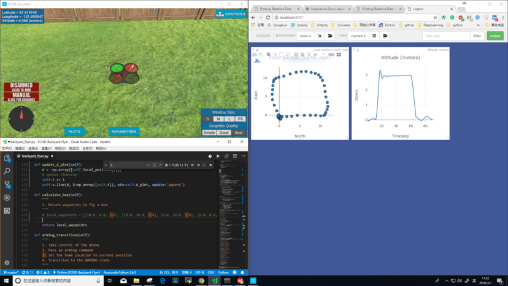

# FCND - Backyard Flyer Project

### Project Overview

In this project, we set up a state machine using event-driven programming to autonomously flying a drone. we using flying a quadcopter in Unity simulator. Goal of the project is to familiar with sending commands and receiving incoming data from the drone. 

The python code you write is similar to how the drone would be controlled from a ground station computer or an onboard flight computer. Since communication with the drone is done using MAVLink, you will be able to use your code to control an PX4 quadcopter autopilot with very little modification!

### Example Output:

